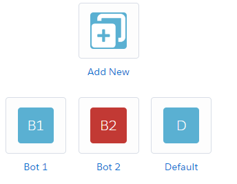
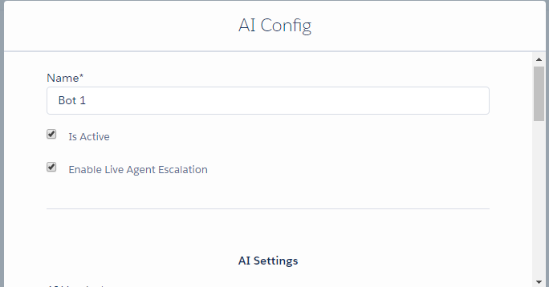
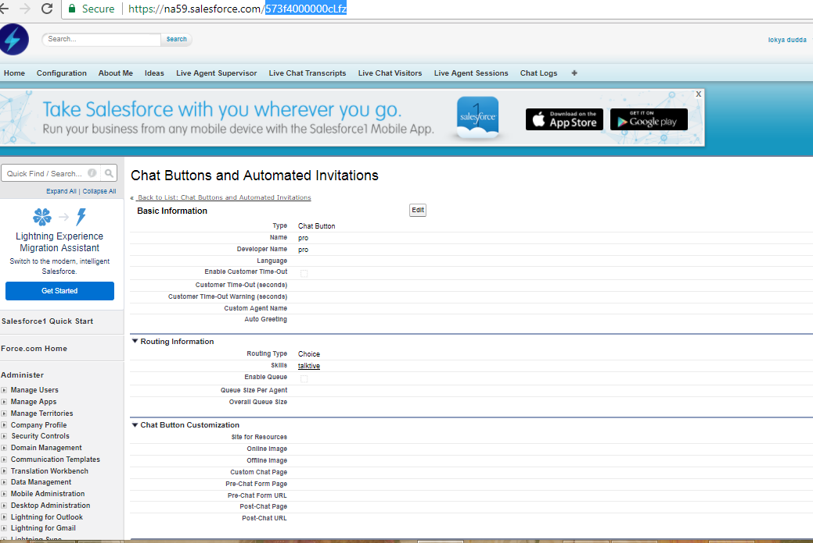
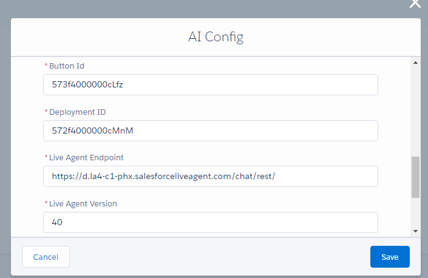
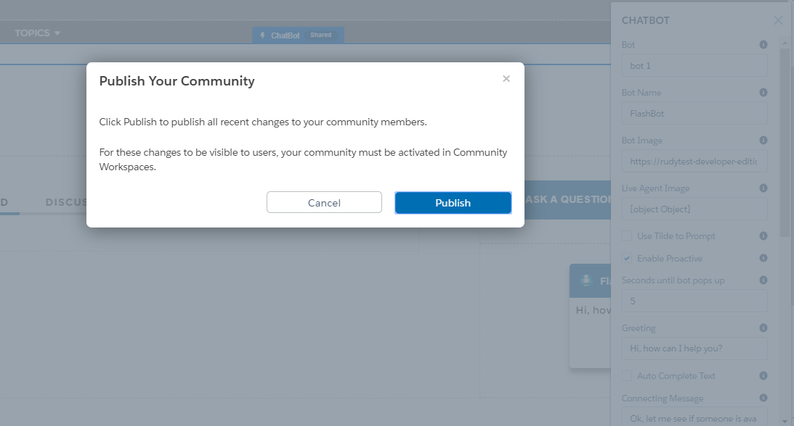

##How to create and setup a new chatbot:

 Clicking on configurations tab it will head to page where admin can see add new tile on the page.

1. AN AI configuration modal pops up after clicking on new, where you can configure your own chatbot.
2. Enter your name in name in name field which id manditory, and make sure you check on is active to work.
3. By Enabling  live agent escalation makes your bot to connect to the appropriate agent which is configured under live agent settings.

###AI settings:
1. AI vendor: We currently support connecting the bot to API.AI, WIT.AI, Lex.
2. Server access token: Developer/server access token of the agent configured with the AI Platform selected in the vendor field
3. Service end point: This field helps you to configure an additonal router.

###Live agent settings:
1. Click on this [link](https://help.salesforce.com/articleView?id=live_agent_set_up_basic_implementation.htm&type=0) to set up live agent for your org.
2. Button ID: To get button ID , follow these steps,
	- From Setup, enter Chat Buttons in the Quick Find box, then select Chat Buttons & Invitations, click on your chat button. Select id from the url and paste it under button id.

3. Deployment id: To get your deployment id follow these steps.
	- From Setup, enter Deployments in the Quick Find box, then select Deployments. Select your deployment and copy the id and paste it over deployment id under live agent settings.
4. Live agent end point: Enter live agent settings in quick search and you will find live live agent api on the settings page, bring that url to the live agent end point.
5. Live agent version: Set it to latest api version of salesforce.

6. Give vistor name and save it.
7. Go to your builder on your community and give your name in chatbot configuration modal and publish it.

8. Go to your community and select the url of your community, should be able to see chatbot on the bottom of the community page.